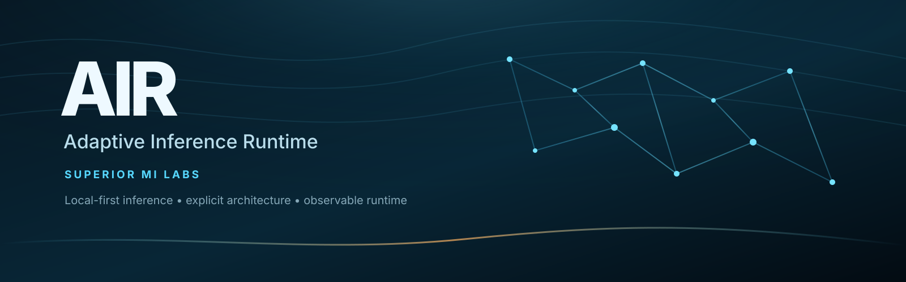
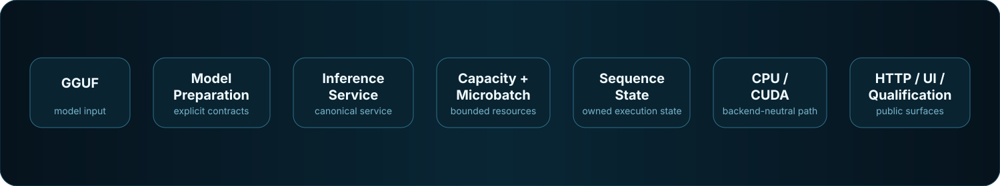

<p align="center">
  
</p>

<h1 align="center">AIR</h1>

<p align="center">
  <strong>Adaptive Inference Runtime</strong><br>
  Local-first inference with explicit architecture, bounded execution,
  observable state, and falsifiable optimization.
</p>

<p align="center">
  <a href="https://github.com/Superior-MI-Labs/AIR/releases/tag/v0.10.0">
    
  </a>
  
  
  
  <a href="LICENSE">
    
  </a>
</p>

<p align="center">
  <strong>
    <a href="https://huggingface.co/spaces/Superior-Mind-Labs/AIR">Hugging Face Space</a>
    &nbsp;•&nbsp;
    <a href="https://github.com/Superior-MI-Labs/AIR/releases/tag/v0.10.0">Release 0.10.0</a>
    &nbsp;•&nbsp;
    <a href="#quick-start-on-linux">Quick Start</a>
    &nbsp;•&nbsp;
    <a href="#architecture">Architecture</a>
  </strong>
</p>

**AIR 0.10.0** is the modular model-architecture boundary release of the
Adaptive Inference Runtime from **Superior MI Labs**.

This release separates qualified model-family interpretation and semantic
tensor binding from backend execution. Qwen2 remains the only qualified
production model architecture in AIR 0.10.0.

AIR is a standalone C++20 inference runtime built around a simple systems idea:
model execution should have explicit ownership, bounded resources, observable
state, and falsifiable optimization instead of accumulating parallel hidden
pipelines.

> **Status:** public research software. AIR is usable and qualified on its
> tested path, but it is not presented as a finished commercial inference
> platform.

## Why AIR

| Local-first | Observable | Explicit | Falsifiable |
| --- | --- | --- | --- |
| Run inference on hardware you control. | Runtime, model, event, and metrics state remain visible. | Ownership and execution contracts are intentionally clear. | Optimizations are expected to survive measurement and destructive testing. |

GitHub is the canonical engineering source for AIR. The public Hugging Face
Space provides an interactive research and presentation surface:

**https://huggingface.co/spaces/Superior-Mind-Labs/AIR**

## What AIR includes

- one canonical production inference service;
- one scheduler architecture;
- reference/CPU and NVIDIA CUDA execution paths behind the same contracts;
- GGUF model loading for the current qualified Qwen2-family scope;
- an internal architecture-adapter boundary that resolves model-family rules
  into validated semantic tensor bindings before execution;
- Reference and CUDA executors that consume the same prepared semantic model
  contract instead of reconstructing Qwen2/GGUF tensor names;
- bounded request queues and explicit HTTP 503 backpressure;
- deterministic cleanup and cancellation;
- backend-neutral sequence-state contracts;
- native generation;
- a bounded OpenAI-shaped completions/chat compatibility surface;
- native semantic `POST /decide`;
- runtime, event, model, and metrics observability;
- a built-in browser command center.

## Browser application

AIR includes a local browser application under `web/`.

When AIR is running, open:

```text
http://127.0.0.1:8181
```

The command center provides:

- Home / connection state
- generation Playground
- Decision
- Models
- Runtime
- Diagnostics
- Metrics
- Setup guidance
- About / Architecture

The browser is a **surface over AIR**, not another runtime or state owner.

The `v0.10.0` release tag and published release artifacts are the authority
for the frozen 0.10.0 release. Historical `v0.9.12` artifacts remain the
authority for that earlier release.

## Quick start on Linux

Clone:

```bash
git clone https://github.com/Superior-MI-Labs/AIR.git
cd AIR
```

Optional guided dependency/build check:

```bash
./bootstrap.sh
```

Or build directly:

```bash
./scripts/build.sh
```

Run the tests:

```bash
ctest --test-dir build --output-on-failure
```

Install into your user prefix:

```bash
./scripts/install-local.sh
```

Start AIR with a supported GGUF model:

```bash
./run-air.sh /path/to/model.gguf
```

Then open:

```text
http://127.0.0.1:8181
```

## Build requirements

Required:

- C++20 compiler
- CMake 3.22+
- pkg-config
- PCRE2 8-bit development headers
- Boost headers including Beast and JSON

For NVIDIA CUDA acceleration:

- compatible NVIDIA GPU and driver
- CUDA Toolkit / `nvcc`
- cuBLAS

CUDA is optional. AIR can use the reference/CPU path when CUDA is unavailable.

AIR is a direct inference runtime. **llama.cpp is not an AIR dependency.**

### Debian / Ubuntu / Linux Mint

A typical base toolchain can be installed with:

```bash
sudo apt update
sudo apt install -y build-essential cmake pkg-config libpcre2-dev libboost-all-dev
```

CUDA installation is intentionally separate because the correct NVIDIA
toolchain depends on your GPU, driver, distribution, and desired CUDA version.

## Public HTTP API

```text
GET  /
GET  /health
GET  /model
GET  /runtime
GET  /events
GET  /metrics
GET  /v1/models

POST /generate
POST /v1/completions
POST /v1/chat/completions
POST /decide
```

AIR's OpenAI-shaped routes intentionally support a bounded compatibility
subset. Unsupported fields should fail explicitly rather than being silently
ignored.

## Native generation

```bash
curl http://127.0.0.1:8181/generate \
  -H 'Content-Type: application/json' \
  -d '{
    "prompt": "Explain deterministic state ownership in one paragraph.",
    "max_tokens": 128,
    "temperature": 0,
    "stream": false
  }'
```

## Native Decision

`/decide` scores a bounded set of semantic candidates without generating a
normal free-form answer.

```json
{
  "input": "Route this request:",
  "candidates": [
    {
      "id": "billing",
      "text": "Billing",
      "model_text": " billing"
    },
    {
      "id": "technical",
      "text": "Technical support",
      "model_text": " technical support"
    }
  ],
  "scoring_policy": "sequence-logprob-mean",
  "output_cardinality": "exactly-one",
  "determinism": "required"
}
```

Important: Decision scores are **candidate-set-normalized relative scores**.
They are not calibrated confidence or probability.

## Architecture

<p align="center">
  
</p>

The high-level execution path is:

```text
GGUF
  ↓
ModelDefinition
  ↓
PreparedModel
  ↓
InferenceService
  ↓
CapacityScheduler
  ↓
MicrobatchScheduler
  ↓
SequenceState
  ↓
Reference or CUDA executor
  ↓
HTTP / Browser / Bench / Qualification
```

AIR's design rules include:

- one authoritative state owner per domain;
- semantic identity is separate from execution-state identity;
- semantic contracts are separate from physical execution plans;
- CapacityScheduler owns device-resource authority;
- the browser never becomes a second runtime;
- reference execution remains an independent correctness oracle;
- source/tests/machine evidence outrank narrative;
- negative results remain useful research evidence.

## AIR 0.10.0 qualification

The frozen release passed a destructive public-release program including:

- 12/12 CTests;
- external `find_package(AIR)` consumer build and execution;
- installed public headers and CMake package;
- public HTTP/API and static-web checks;
- generation and Decision workloads;
- bounded overload/backpressure;
- malformed and over-context fault injection;
- shutdown/restart;
- warmed resource soak and reclamation checks;
- release archive and installed-file checksum verification.

Frozen release identity:

```text
Version:                    0.9.12
Qualified source fingerprint:
587928104d2da182d30903daf00b30d1bd45f3115dcb4896bf3ea3bc70f04fb3

Qualified release archive SHA-256:
78e463df6c3eb4c8f6f550430fe429579cf08a678bc7cb1d047a702a76763c9f
```

## Current V1 limitations

AIR 0.10.0 does not claim:

- calibrated Decision confidence/probability;
- `qualified-auto` production Decision scorer selection;
- abstention or multi-select threshold execution;
- persistent CUDA cross-request sequence-state retention;
- fuzzy/semantic execution-state reuse;
- arbitrary GGUF architecture compatibility;
- generic response caching/single-flight inside AIR.

Those omissions are deliberate public boundaries, not hidden features.

## R&D status

AIR is part of an early-stage Superior MI Labs R&D effort in Upper Michigan.

The broader direction includes inference architecture, reasoning systems, local
compute infrastructure, developer tooling, education, and practical AI systems
that can eventually support communities, entrepreneurs, researchers, and local
organizations.

The project is early. Testing, technical discussion, bug reports,
contributions, collaboration, and constructive criticism are welcome.

## License

The public repository is licensed under the **Apache License 2.0**.

See:

- `LICENSE`
- `NOTICE`
- `OPEN_SOURCE_SCOPE.md`

The license applies to the material actually published here. Unpublished
Superior MI Labs components are not automatically licensed, and project names
or branding are not granted as trademarks by the Apache License.
